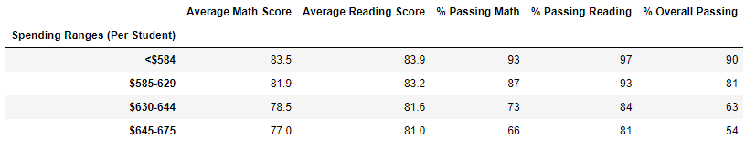

# PyCity School District Analysis

## Overview of Project
The purpose of this analysis is to review, clean, and present the testing resutls from various schools in the district. We have been asked to present that data so it illistrates how the shools perfomed on a number of factors such grade level, shool size, type of shcool, and budget. This will help the school board drive strategy by understanding performance trends and patterns.

## Results
- How is the distric summary affected?
  Due to some concerns regarding academic dishonesty, we were asked to remove the math and reading scores for all 9th graders from Thomas High School. The average math and reading   scores remained the same. The passing percentage for math and reading decreased by a percent. Over all, the removal of the grade scores from 9th graders at Thomas High School     had little effect and did not change the schools ranking. 
  
  Before
 
  After

- How is the school summary affected?

  The school summary was not affected by the removal of the 9th grade scrores. When recalculating the percentages, the total number of students did not include 9th graders from     Thomas High Schools. There was not a noticable change in the schools suammary.
  
  Before
 
 
 After

- How does replacing the ninth graders’ math and reading scores affect Thomas High School’s performance relative to the other schools?
  Replacing the ninth graders math and reading scores had little affect in relation to the other schools. The percentage changed did not have an affect on the overall ranking of   the school. 
  
  Since the the change in average and percentage we minimal at the school level, when used in aggregate to calculate other data points such as scores, by spending, school size,  by school type, the remmoval of the 9th grade math and reading scores had little effect. 
  
 

 

  
